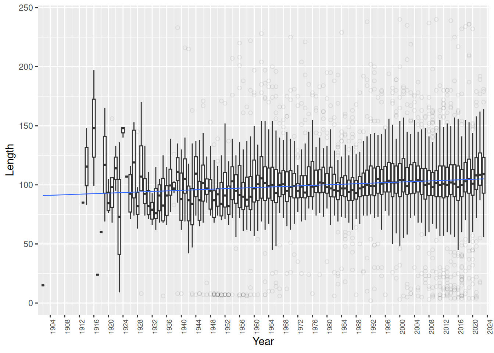
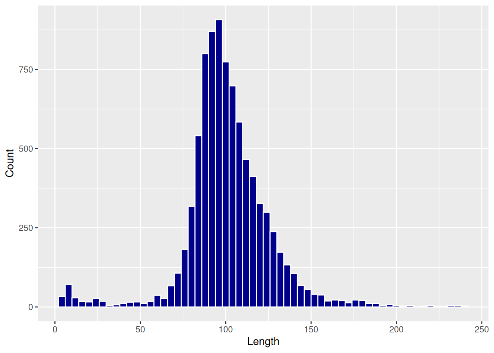
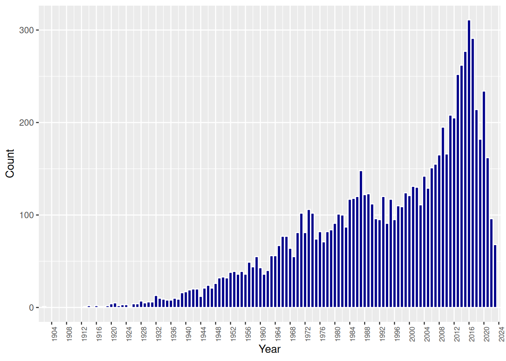
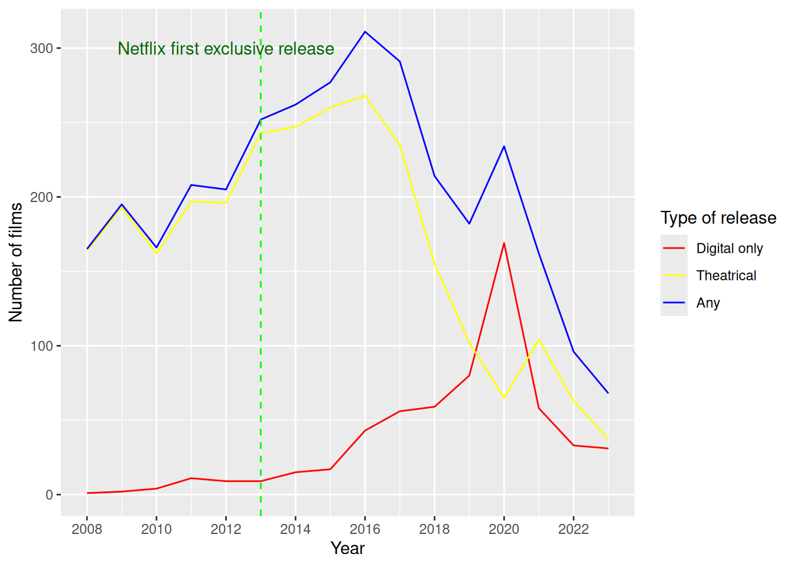
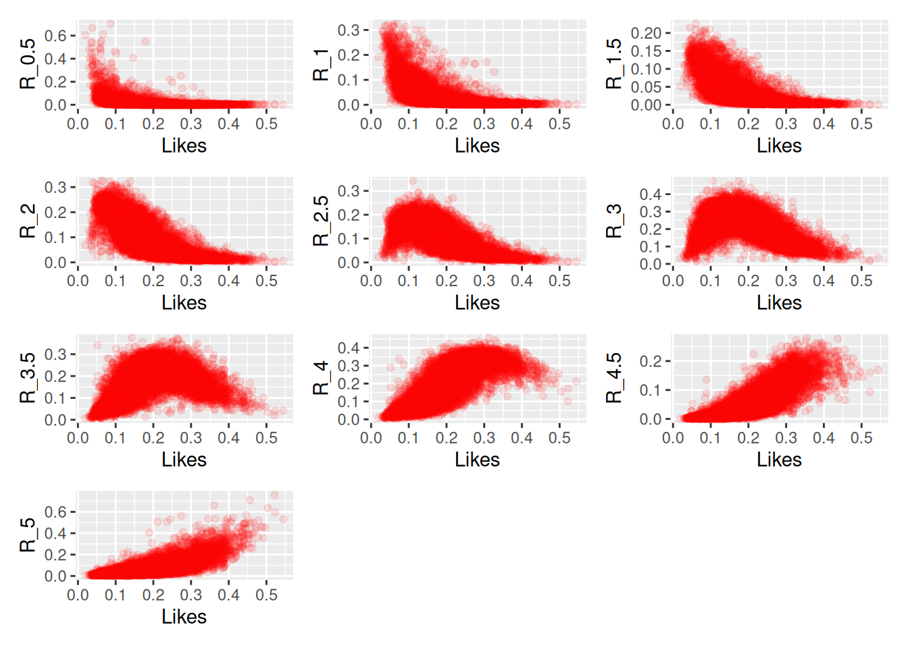
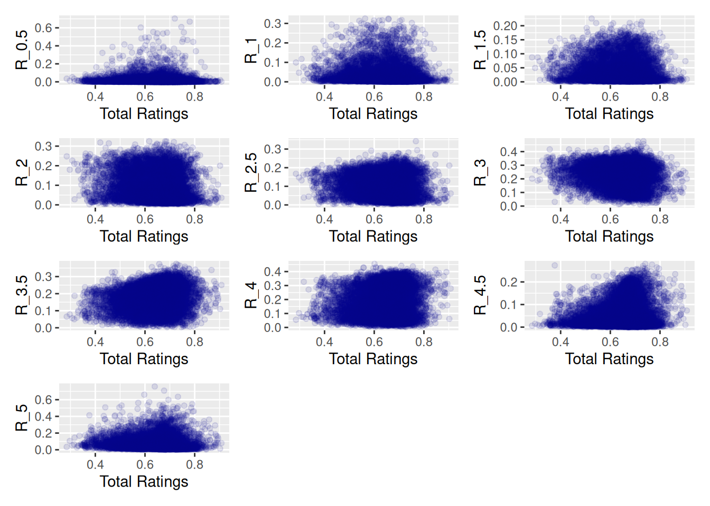
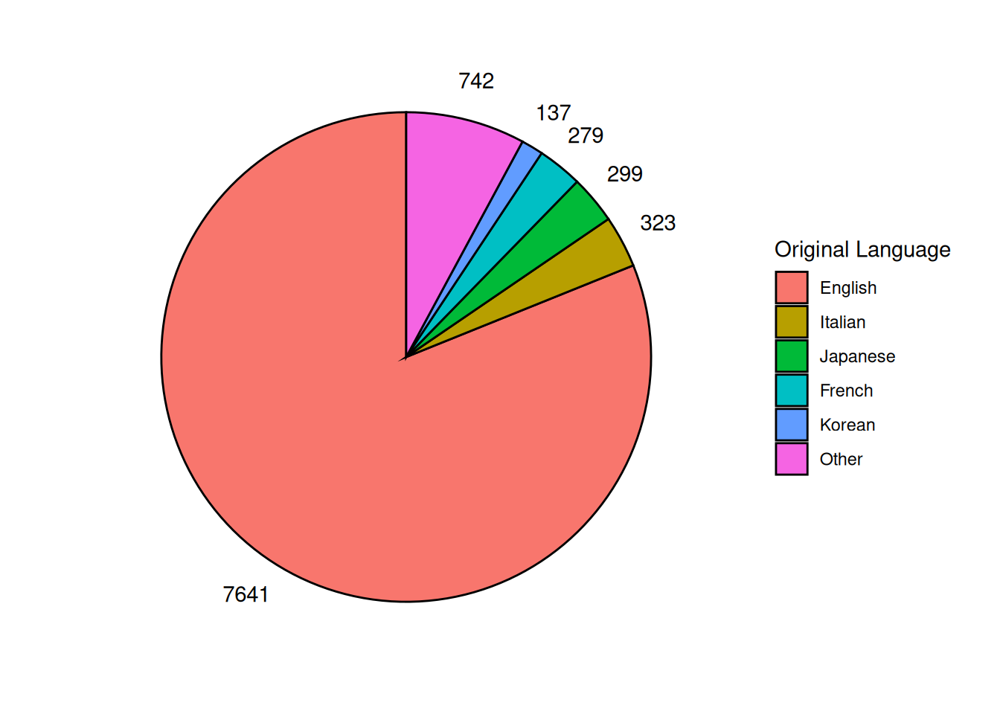
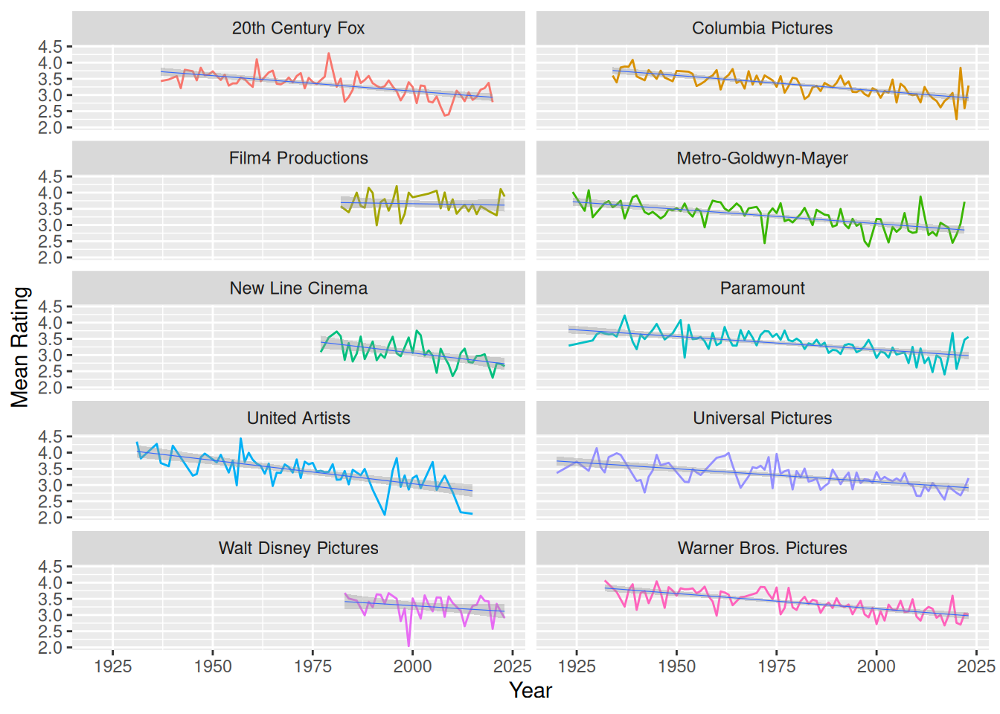

```{r setup, echo=FALSE}
library(dplyr)
library(ggplot2)
library(plotly)
library(knitr)
library(maps)
library(countrycode)
library(patchwork)
library(reshape2)

movies <- read.csv("../movies.csv", header = TRUE) |>
  filter(!is.na(date), !is.na(rating), minute <= 240)

studios <- read.csv("../studios.csv", header = TRUE)

releases <- read.csv("../releases.csv", header = TRUE) |>
  filter(country == "USA") |>
  filter(type == "Theatrical" | type == "Digital") |>
  select(-date)|>
  distinct()|>
  rename(age_rating = rating)

genres <- read.csv("../genres.csv", header = TRUE)

countries <- read.csv("../countries.csv", header = TRUE)

letterboxd <- read.csv(file = "../Movie_Data_File.csv", header = TRUE) |>
  select(Film_title, Average_rating, Watches,Likes,R_0.5,R_1,R_1.5,R_2,R_2.5,
         R_3,R_3.5,R_4,R_4.5,R_5,Total_ratings, Original_language) |>
  filter(!is.na(Average_rating)) |>
  rename(title = Film_title)|>
  mutate(R_0.5 = R_0.5 / Total_ratings, R_1 = R_1 / Total_ratings, 
         R_1.5 = R_1.5 / Total_ratings, R_2 = R_2 / Total_ratings, 
         R_2.5 = R_2.5 / Total_ratings, R_3 = R_3 / Total_ratings, 
         R_3.5 = R_3.5 / Total_ratings, R_4 = R_4 / Total_ratings, 
         R_4.5 = R_4.5 / Total_ratings, R_5 = R_5 / Total_ratings, 
         Likes = Likes / Watches, Total_ratings = Total_ratings / Watches)
```


## Column 1 {data-width=300}
-----------------------------------------------------------------------

### **Introduction**

This project is dedicated to film's analysis and users' behaviour correlation. The goal of the analysis is to determine trends in film industries, and correlation between users’ behaviour and film quality.

#### **Theory**

In this analysis we use Spearman’s Rank Correlation to determine monotonic relationship between variables. The equation can be written as: 
$$
\rho  = 1 - {6\sum{d^2}\over{n(n^2-1)}}
$$
Where: 

* **ρ**: Spearman's Rank Correlation
* **d**: difference between ranks of corresponding values
* **n**: total number of observation    

### **Conclusions**


* Determined positive linear trend in length of films
* Determined the most popular range of length
* Found correlation between decrease in number of films and start of COVID-19 pandemic
* Growth of a digital only releases as pandemic started in 2020
* Determined top 4 genres over all and top 4 genres in only digital releases
* Showed map of most produced genres throughout the world
* Proportion of film languages
* Determined negative linear trend in average rating of big studious films
* Determined correlation between proportion of likes and proportion of each rating


## Column 2 {data-width=350, .tabset}
-----------------------------------------------------------------------

### Lenght of the Films

<div>
{width=100%}
</div>

There is a clear positive linear trend, but it's pretty slow in growth, that's mean that it's a weak trend.

<div>
{width=100%}
</div>

There we can see that the most popular range of film's length is from 80 minutes to 130 

### Number of Films per year

<div>
{width=100%}
</div>

<div>
{width=100%}
</div>

In first figure there is a sharp decline of films after 2020, and it coincidence with a start of COVID-19 pandemic, when all cinemas were closed on the duration of pandemic. That led to increase in digital only releases that we can see in second figure.

### Correlation

<div>
{width=100%}
</div>

This figure show us a pretty strong correlation between percentage of each rating and percentage of likes on a film. 

<div>
{width=100%}
</div>

While this figure show us an opposite, a very weak correlation between percentage of each rating and percentage of total ratings.

### Correlation table

<div>
```{r}
library(knitr)
c1 <- cor(letterboxd[,5:14], letterboxd[,4], method = "spearman")
c2 <- cor(letterboxd[,5:14], letterboxd[,15], method = "spearman")
rownames(c1) <- NULL
rownames(c2) <- NULL

table <- data.frame(
  Rating = c("R_0.5","R_1","R_1.5","R_2","R_2.5",
             "R_3","R_3.5","R_4","R_4.5","R_5"),
  Likes = c1[,1],
  Total_Rating = c2[,1])

kable(table, align="l")
```
</div>

This table let us determine a numerical values of correlations that we saw in previous figures. Values were calculated by Spearman's Rank Correlation because this correlations aren't linear. 

## Column 3  {data-width=350, .tabset}

### Genres Popularity
<div>
```{r}
library(plotly)
p1 <- inner_join(movies, genres, by = "id") |>
  filter(date >= 2012)|>
  group_by(date, genre)|>
  summarise(n = n()) |>
  ggplot() + 
  aes(x = date, y = n, group = genre) + 
  geom_line(aes(color = genre)) + 
  geom_point(size = 1, aes(color = genre)) +
  scale_x_continuous(breaks = seq(2012, 2024, by = 2)) +
  labs(
    x = "Year",
    y = "Number of films",
    color = "Genre"
  ) +
  guides(color=guide_legend(ncol=2))

ggplotly(p1) |>
  layout(xaxis = list(autorange = TRUE), yaxis = list(autorange = TRUE))
```
</div>

Popularity of each genres throughout the years. Top 4 of them are Drama, Comedy, Action and Thriller.

### Genres Map
<div>
```{r}
library(maps)
library(countrycode)

dat_for_map <- inner_join(genres, countries, by = "id") |>
  mutate(country = countrycode::countrycode(
    sourcevar = country, origin = 'country.name', destination = 'country.name')
  ) |>
  group_by(genre, country)|>
  summarise(n = n())|>
  ungroup()|>
  group_by(country)|>
  slice(which.max(n))
dat_world_map <- map_data("world") |> 
  mutate(region = countrycode::countrycode(
    sourcevar = region, origin = 'country.name',destination = 'country.name')
  )
p <- full_join(x = dat_for_map, y = dat_world_map, 
                      by = c("country" = "region"),
                      multiple = "all", relationship = "many-to-many") |> 
  ggplot(mapping = aes(x = long, y = lat, group = group)) +
  geom_polygon(mapping = aes(fill = genre)) +  
  coord_fixed(ratio = 1.3) +
  labs(fill = "Genre") + 
  theme_void()
ggplotly(p) |>
  layout(xaxis = list(autorange = TRUE), yaxis = list(autorange = TRUE))
```
</div>

This map shows the popularity of genres in different countries. Still a lot of countries has Drama as their top 1, such as in popularity of genres over all.

### Film Languages

<div>
{width=100%}
</div>

This figure shows a proportion of languages to each other. The winner there is obviously English, but still, 1/6 of all movies are made in other languages 

### Biggest Studious

<div>
{width=100%}
</div>

On the figure are shown top 10 of all studious by a number of films. And there we can see a negative trend of mean ratings throughout the years. 