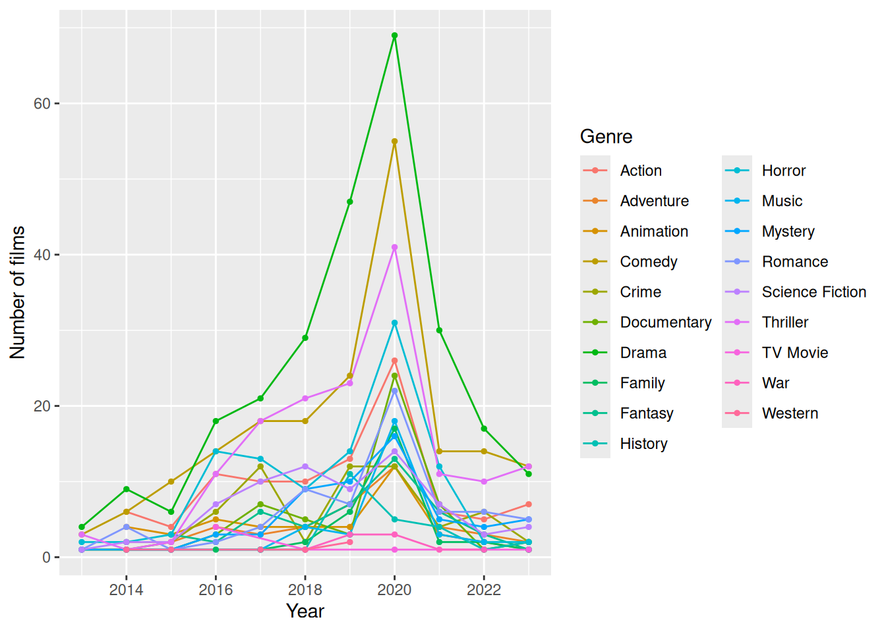
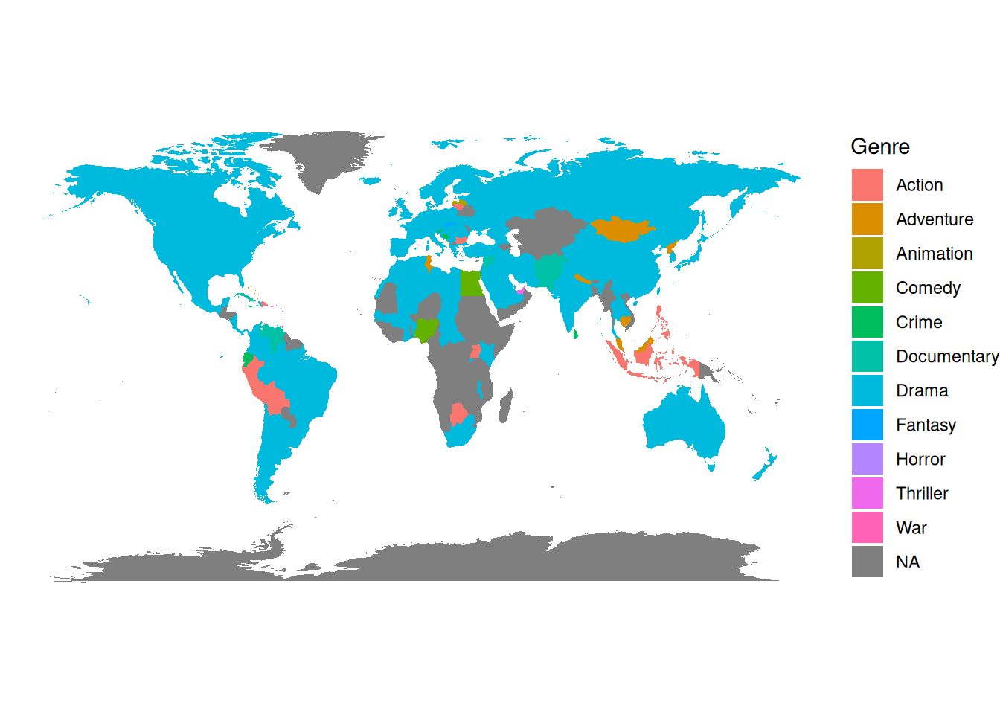

## Introduction

Analysis is dedicated to films trends and correlations in users' behaviour. Two data sets are used: [@movies] and [@letterboxd].

## Theory

**Spearman’s Rank Correlation** is used for calculating correlation between variables. It's used in this analysis because:

-   Ideal for non-linear associations
-   Used for monotonic relationship

$$
\rho  = 1 - {6\sum{d^2}\over{n(n^2-1)}}
$$

## Length of the movie

{fig-align="center"}

As shown on the graph, positive linear trend in the length of films can be seen.

## Number of films and COVID-19

{width=50%}

There is a sharp decline of films after 2020, and it coincidence with a start of COVID-19 pandemic, when all cinemas were closed on the duration of pandemic. 

## Popularity of Genres

{fig-align="center"}

Top 4 genres in film industry are Drama, Comedy, Action and Thriller.

## Map of the Most Produced Genre of Films in Country

{width=60%}

A lot of countries popular genre correlates with genre popularity over all, but there is some countries that makes not that popular genres, for example War or Documentary. 

## Languages of films

{fig-align="center"}

The most popular language in films is English, but other languages still have a 1/6 part from all films.

## Big Studious

{fig-align="left"}

As time goes, the mean rating of films from top 10 studious by number of films is dropping. We can see it clearly as a negative linear trend.

## Users' behaviour with Likes

{width=50%}

From this graphs we can determine that likes and ratings of a film has a strong correlation

## Users' behaviour with Total Ratings 

{fig-align="left"}

While total ratings and ratings has a very weak correlation.

## Conclusions

As a result of this project we determined that films' length is growing and COVID-19 had a big impact on film industry, calculated most popular genres over all and produced in every country, determined the percentage share of each language in the total, saw a decreasing of mean rating in big studious and determined correlation between rating and likes/total ratings.

## References